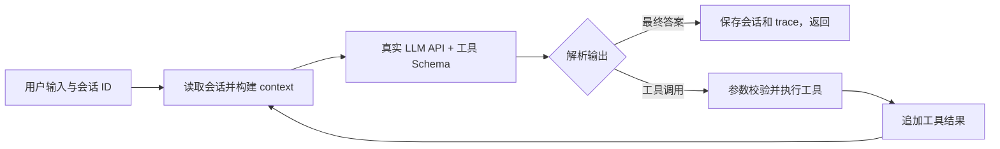

# 最小 Agent：用 Python 从零实现工具循环

一个用于面试演示、方便读懂的小项目。核心循环、工具注册、参数校验、会话持久化、上下文压缩和 trace 都是自己写的，**没有使用 LangGraph、OpenHands、OpenClaw 或其他 Agent 框架**。

运行时通过真实的 **Chat Completions HTTP API** 调用模型，由模型基于工具的名称、描述和参数 Schema 决定直接回答还是调用工具。计算器和待办真实执行；搜索、天气明确使用 mock 数据。

## 1. 先运行起来

需要 Python **3.10 或以上**，只使用标准库，**不用 pip 安装任何包**。

进入这个 README 所在的“最小Agent”目录，然后在 PowerShell 执行：

```powershell
Copy-Item .env.example .env
notepad .env
```

仅在第一次配置时复制，避免覆盖自己已有的配置。在 `.env` 填写你自己的真实 API Key：

```dotenv
LLM_API_KEY=填入你自己的密钥
LLM_BASE_URL=https://api.deepseek.com
LLM_MODEL=deepseek-v4-flash
```

也可接入支持 **Chat Completions 原生 function calling** 的 OpenAI 或其他兼容服务：修改 `LLM_BASE_URL` 和 `LLM_MODEL`。BASE_URL 填基础地址，不要包含 `/chat/completions`；模型需在你的 API 账号中可用。此项目不对接只支持 Responses API 的模型。环境变量优先于 `.env`，不支持 `.env` 变量插值。

对官方 DeepSeek 地址，客户端显式设置 `thinking.type=disabled`，使用非深度思考模式，避免额外处理跨轮次 reasoning 字段。切换服务商时请使用支持普通 function calling 的模型。

```powershell
$env:PYTHONUTF8="1"
python -m mini_agent --user A --session window1 --trace
```

输入 `/exit` 退出，`/state` 查看当前会话状态。普通回答也会走真实 API，没有按关键词伪造的“假 LLM 模式”。密钥为空时明确报错。

如果希望运行文件全部放在桌面的“项目制作过程”，可在 PowerShell 设置：

```powershell
$env:AGENT_DATA_DIR = Join-Path ([Environment]::GetFolderPath('Desktop')) '项目制作过程\最小Agent运行数据'
python -m mini_agent --user A --session window1 --trace
```

也可运行 `run_windows.ps1`：它自动设置上述数据目录；优先读取桌面 `项目制作过程/最小Agent-API配置.env`（如果存在），否则读取项目 `.env`。默认直接运行 Python 且不传数据目录时保存在本项目 `.runtime` 中。API Key 保存在本机配置文件，不会打包或上传 GitHub。

```powershell
powershell -ExecutionPolicy Bypass -File .\run_windows.ps1 -Session window1
```

上面的 ExecutionPolicy 只对本次 PowerShell 进程生效，不修改系统策略。窗口 2 把 `window1` 换成 `window2`。

## 2. 五分钟演示

**窗口 1**：

```powershell
python -m mini_agent --user A --session window1 --trace
```

依次输入：

```text
你好，请叫我小林。
请用计算器计算 (12+8)*3。
把刚才的结果除以4。
查上海的模拟天气，再帮我记一条待办：明天带伞。
把刚才带伞那条待办标记完成。
我让你怎么称呼我？
```

**窗口 2**：另开一个终端，进入同一目录：

```powershell
python -m mini_agent --user A --session window2 --trace
```

```text
搜索周报写法，帮我写一个三行周报模板，再记待办：周五写周报。
列出我的待办。
```

窗口 1 的“带伞”和窗口 2 的“写周报”应互相独立。退出窗口 1 后用相同 `--user A --session window1` 启动，再问“我的待办有哪些”，仍然能接着聊。不同终端必须使用同一数据目录。

查看状态无需 API Key：

```powershell
python -m mini_agent --user A --session window1 --inspect
```

## 3. 系统设计

把它理解为：**模型提出行动，Python 执行行动，再把执行结果交回模型。**



建议按以下顺序读代码：

| 文件 | 负责什么 |
| --- | --- |
| `mini_agent/runtime.py` | `Agent.chat()` 主循环：模型调用、工具执行、退出条件 |
| `mini_agent/tools.py` | 注册工具、导出 Schema、校验参数和执行四个工具 |
| `mini_agent/llm.py` | HTTP API、超时重试、`parse_response()` 输出解析 |
| `mini_agent/storage.py` | SQLite 保存状态、归档对话和 trace，隔离会话 |
| `mini_agent/memory.py` | 系统 Prompt、记忆召回、完整轮次压缩和长度限制 |
| `mini_agent/__main__.py` | 接收命令行输入与显示结果 |

### 主循环的关键点

1. 收到输入，按 `(user_id, session_id)` 读取状态并锁住当前会话。
2. 组装 context，把注册表生成的 `tools` Schema 一起交给真实模型，`tool_choice="auto"`。
3. 解析 `choices[0].message`。有 `tool_calls` 就执行工具；没有调用且有有效文本就是最终答案。
4. 对每个调用解析 JSON 参数、校验 Schema、执行函数，得到成功或错误结果。
5. 先记录 assistant 的工具调用，再写入带匹配 `tool_call_id` 的 tool 消息。
6. 将这些消息交回模型，让它自主选择继续或回答。最多 6 次模型决策。
7. 返回答案并保存状态。发生 API 错误时明确返回错误，同时保存本轮已完成的本地操作。

不是通过“输入包含天气就调用 weather”来模拟决策。可以查看 trace，确认模型真正选了什么工具。

### 工具注册机制

| 名称 | 参数 | 行为 |
| --- | --- | --- |
| `calculator` | `expression: string` | 安全解释算术 AST，支持 `+ - * / // %`、小数、负数和括号 |
| `search` | `query: string` | mock 搜索三条本地资料：Agent、Memory、周报；无命中返回空列表 |
| `weather` | `city: string` | mock 北京、上海、杭州天气；结果含 `mock: true` |
| `todo` | `action: add/list/done`，可选 `text`、`id` | 实际添加、列出、完成当前会话待办 |

`Registry.register()` 接收名称、描述、参数定义、必填项和 Python 函数，`schemas()` 统一导出给模型，`execute()` 统一校验和执行。添加第五个工具只需写一个函数并注册，不修改 Runtime。

这个演示版实现当前工具需要的 Schema 子集：对象、必填参数、禁止多余参数、字符串长度、整数和枚举；不是完整 JSON Schema 校验器。todo 的 add/text、done/id 条件约束由描述告知模型、工具函数再次校验。每会话最多 20 条待办，同内容添加会去重。

计算器不使用 `eval`，拒绝函数调用、变量、幂运算和超出范围的数值。

### 输出解析与“思考过程”

优先让模型在普通 content 中输出：

```json
{"reason":"需要通过计算器获得准确结果","answer":"计算结果是 60。"}
```

真正的工具调用走 API 的 `tool_calls` 字段，参数是 JSON 字符串。解析器分别提取 `reason`、工具调用和 `answer`，也兼容直接文本答案。

**这里的 `reason` 是可展示的一句话决策摘要，不是完整内部思维链**。不会要求、提取或存储服务商的隐藏推理字段。这个摘要用于理解工具决策和 trace，控制流程以结构化工具调用为准。模型没有返回摘要时保留空值，不编造。历史工具调用的 content 可能保留这句摘要；不会额外把长推理塞进 context。

## 4. Session 与 memory：什么时候召回，放在哪里

**每次用户发言先召回一次会话；每次模型调用前都重新组装 context，包括刚执行的工具结果。**

同一个 `(用户, 会话)` 对应同一个 SQLite 文件，文件名是这两个值组成 JSON 后的 SHA-256，不直接把用户输入当文件路径。不同用户、不同窗口各用不同文件；相同会话被同时请求时，第二个请求得到“会话忙”的提示。不同会话可以独立运行。

模型请求内容的放置顺序：

| 顺序 | 内容 | 角色或位置 | 原因 |
| --- | --- | --- | --- |
| 1 | 固定行为规则 | `system` | 规定工具使用、错误处理、mock 标注和输出格式 |
| 2 | 旧对话摘要、完整待办、最近各工具结果 | 独立 `user` 数据消息 | 明确为历史数据，不把摘要提升成系统指令 |
| 3 | 最近最多 4 个完整历史轮次 | 原始 `user/assistant/tool` 消息 | 支持“刚才那个”“再改短一点”等追问 |
| 4 | 当前输入、本轮调用和结果 | 原始消息 | 让模型知道本次已完成什么以及下一步如何行动 |
| 同时 | 工具名称、描述、参数 Schema | API 的 `tools` 字段 | 让模型自主选择工具和生成参数 |

持久化有三个表：`state` 是下一轮会话需要的活动状态，`turns` 归档完整轮次，`traces` 是执行日志。运行时只自动读取 `state`，不会把全部归档重新塞入 context。

**压缩策略**：历史超过 4 个轮次，或消息加工具 Schema 的 JSON 超过 24,000 字符时，将最老的完整轮次移入摘要。摘要摘取用户消息、助手回答和工具结果的短片段，最多 2,400 字符。待办与最近各工具结果单独保存，不依赖摘要猜测待办状态。摘要不调用额外 LLM，行为确定且易测试。

按完整轮次压缩，避免出现“只有 tool 结果，却找不到对应 assistant 调用”的无效 API 消息。当前轮次不会被拆开；如果旧历史都已压缩仍超限，就停止本次任务并请用户拆分。

这是**基础有损压缩**：很久以前的闲聊细节可能丢失，摘要没有语义重要性排序，不等于永久记住一切。字符预算是易懂的近似控制，不是精确 tokenizer，也未声称适配所有模型的 token 上限。固定历史数量之外还有限长输入、限长工具结果和有限轮次。

## 5. 异常处理与 trace

| 情况 | 处理 |
| --- | --- |
| 未配置 API Key | 直接说明如何配置，不使用假响应代替 |
| 超时、网络失败、429、常见 5xx | HTTP 请求最多重试一次，30 秒超时；不重放本地工具 |
| 401、其他不可重试状态 | 返回清晰错误，不打印密钥或服务商响应正文 |
| 402 余额不足 | 提示到服务商开放平台充值；真实冒烟测试停止后续用例并记录跳过数 |
| 模型输出为空、结构不对、截断、重复调用 ID | 记录解析错误，提示修正，仍受最大轮次限制 |
| 工具名未知、参数 JSON 错误、Schema 不符、除零 | 作为 `ok:false` 的 tool 结果交给模型，让它修正或解释 |
| 达到 6 次模型调用或 context 超限 | 返回明确终止状态，不声称任务完成 |
| 同一会话同时请求 | SQLite 互斥，快速提示会话忙 |

trace 包含时间、用户、会话、run_id、轮次、简短决策说明、工具名、参数、结果、耗时和最终状态。`--trace` 在终端显示，数据库持久化保存，`--inspect` 查看最近 30 条事件。

为使事务逻辑简单，一个会话的一次请求在一个 SQLite 事务内完成。可处理的 API/工具错误会保存已完成的本地操作；强制结束进程或 Ctrl+C 则回滚当前未提交轮次。过去已提交轮次不受影响。未来如果增加转账、邮件等外部副作用工具，需要单独设计幂等与恢复机制。本项目只有本地待办写操作。

用户 ID 是命令行演示标识，**不是登录认证系统**。项目用于本机面试演示，未实现网络服务、权限平台或生产环境安全隔离。日志可能含用户输入和工具内容，本地运行数据不纳入提交包。

## 6. 测试

不需要密钥的确定性测试：

```powershell
python -m unittest discover -v
```

测试使用 `ScriptedLLM` 固定模型输出，验证 Runtime 是否正确地执行、回填、隔离、压缩和停止；**这些测试不能证明真实模型一定会正确选择工具**。HTTP 测试验证请求与重试逻辑，但不访问服务商。

真实 API 冒烟测试（需要密钥，会产生 API 请求费用）：

```powershell
python scripts/live_smoke.py
```

它真实调用模型，验证计算、带工具追问、天气后记待办、周报搜索、待办完成、纯对话追问、窗口隔离，输出 `.runtime/live/<时间>/report.json`。无密钥会失败，不会自动跳过再显示通过。所有测试实际执行状态见 [TEST_REPORT.md](TEST_REPORT.md)。

## 7. 提交材料和讲解

- 本文件：运行方法、系统设计和 memory 说明。
- [AI_PROMPTS.md](AI_PROMPTS.md)：AI 辅助开发指令记录及运行 Prompt 的说明。
- [PROBLEM_SOLVING.md](PROBLEM_SOLVING.md)：问题、选择、修复和实际验证记录。
- [INTERVIEW_GUIDE.md](INTERVIEW_GUIDE.md)：面试时可以自己讲清楚的版本。
- [TEST_REPORT.md](TEST_REPORT.md)：实际测试结果与真实 API 验证状态。
- `tests/`、`scripts/live_smoke.py`：可复现的测试代码。

协议参考：[OpenAI 官方 Function calling 文档](https://developers.openai.com/api/docs/guides/function-calling)、[DeepSeek 官方工具调用文档](https://api-docs.deepseek.com/guides/function_calling)。本项目自行实现 HTTP 调用和循环，不使用 Agent SDK。
